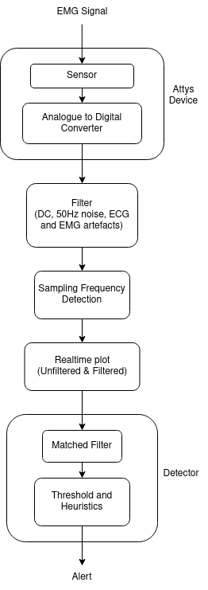

# EMG-posture-corrector-IIR-filter

The purpose of this project was to apply an IIR filter design to solve a real-life issue. When studying, we spend long periods sitting on a chair and tend to use postures which might be harmful or cause back pain. Our team decided to produce a program which would notify the user if they were slouching, allowing them to know they have to correct their posture.

As observed in the figure above, 5 different pieces of equipment were used for data acquisition:

a) Elastic band with bipolar electrode montage. This device wrapped like a belt around the user's waist and hence ensured close contact between the active electrodes and the subject's skin. The bipolar electrodes observed an adjacent separation distance of 4.5cm between each other, one was placed at the far right side of the trunk, the other 4.5cm away on the user's back.

b) One CE Certified Ag/AgCl electrode with solid gel was placed on the subject's wrist bone. This location hence acted as an electric neutral for the whole circuit, due to the wrist bone's low electrical conductivity. This electrode was single-use only.

c) A standard lead cable, which connected the single-use electrode to the Ground port of the Attys device.

d) Attys DAQ. A portable data acquisition device, which transfered the recorded information to the computer via bluetooth. This device was connected to the elastic band with the help of cables to the positive and negative ports of Channel 1, and to the single-use electrode via the Ground (GND) port.

e) ASUS-BT500 Dongle. This device strengthened and optimised bluetooth connection between the Attys device and the computer.

The flow of information was carried out following the procedure outlined in the figure below:

  

